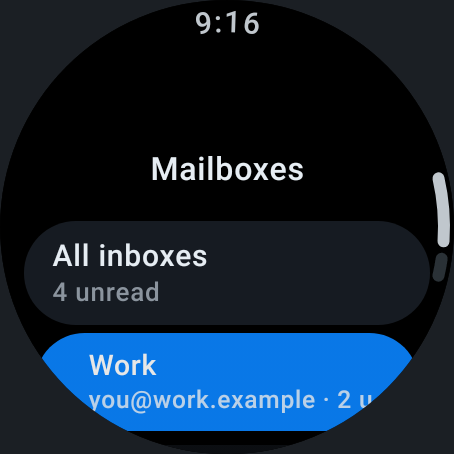

<p align="center">
  
</p>

# ThunderWren 🐦⚡

**A Wear OS companion for Thunderbird for Android.**

ThunderWren brings your Thunderbird inbox to smartwatches running Wear OS 3+. Thunderbird on your phone keeps doing the mail syncing. The watch shows your inboxes, lets you triage messages with a tap, and hands off to the phone for reading in full or replying. The watch never stores your passwords or connects to a mail server.

It lives in a fork of the Thunderbird for Android repository. The design is proposed upstream in [RFC 0010](docs/engineering/rfcs/0010-wear-os-companion.md).

> [!IMPORTANT]
> **Project status: working prototype, not yet tested on real hardware.** The phone and watch sides are implemented and covered by unit and UI tests, but haven't been run on a paired phone and watch yet. The watch needs the Thunderbird phone app **built from this fork**; the Thunderbird app from the Play Store doesn't include the companion.
>
> **Just curious?** You don't need a phone. Install only the watch app and tap **Try the demo**.

<p align="center">
  
  
  
</p>
<p align="center"><em>The demo mailbox, rendered from the real watch UI.</em></p>

---

## ✅ What works today

| Area | Status | Notes |
|---|---|---|
| Inbox on the watch | ✅ | The newest 25 messages with sender, subject, preview, date, and unread/starred state. |
| Unified inbox or one account | ✅ | Tap the mailbox name at the top of the inbox to switch between "All inboxes" and each account. The watch remembers your choice. |
| Mark read/unread, star, archive, delete | ✅ | Sent to the phone, which applies them like the phone app does. Opening a message marks it as read. |
| Open on phone | ✅ | Opens the message in Thunderbird on the phone, for reading in full and replying. |
| Unread Tile and complication | ✅ | Show the unified inbox's unread count and update when the phone publishes new data. |
| Encrypted messages | ✅ | Shown as encrypted, with a prompt to read them on the phone. |
| Works briefly offline | ✅ | The watch keeps the last data the phone sent. |
| Demo mailbox | ✅ | **Try the demo** on the watch shows a sample mailbox with working actions, no phone needed. Real data from Thunderbird on the phone replaces it automatically. |
| Phone notifications on the watch | ✅ Improved | Thunderbird's phone notifications now offer **Star** on the watch, and their actions follow your notification action order. |
| Replying from the watch | ⬜ Not started | Use "Open on phone" for now. |
| Folders other than the inbox | ⬜ Not started | |
| Watch notifications | ⬜ Not started | Thunderbird's phone notifications are still bridged to the watch by Wear OS as usual. |
| Standalone mode (no phone) | ⬜ Not planned yet | See the RFC for why the phone does the syncing. |

---

## 🧱 How it works

```
 Phone: Thunderbird (full/Play build)             Watch: ThunderWren
 ┌──────────────────────────────────┐             ┌──────────────────────────┐
 │ :feature:wear:companion:internal │─ mailboxes ▶│ Inbox, mailbox picker,   │
 │  • publishes each inbox          │─ inboxes ──▶│ message screen, Tile,    │
 │  • applies watch actions         │◀─ requests ─│ complication             │
 │  • "open on phone" entry point   │             │                          │
 └──────────────────────────────────┘             └──────────────────────────┘
                 both use :feature:wear:companion:api (protocol)
```

* **`:feature:wear:companion:api`**: the shared protocol, covering Data Layer paths, message and mailbox models, and the JSON codec.
* **`:feature:wear:companion:internal`**: the phone side, included in Thunderbird's `full` (Play) flavor. It publishes the mailbox list and one inbox snapshot per mailbox over the Wearable Data Layer. It also applies actions through `MessagingController` and opens messages on request.
* **`:feature:wear:companion:noop`**: included in the `foss` (F-Droid) flavor instead, because the Data Layer needs Google Play Services.
* **`:app-thunderwren`**: the Wear OS app. It depends only on the protocol module.

---

## 🛠️ Getting Started

### Requirements

* A recent **Android Studio** release that supports Android Gradle Plugin **9.4**. If Gradle sync says the AGP version is unsupported, update Android Studio.
* Gradle JDK **17 or newer**. Android Studio's bundled JDK works.
* Android SDK Platform **37** (the project's `compileSdk`). Android Studio offers to install it on first sync.
* A **phone emulator with Google Play** (or a real phone) and a **Wear OS 3+ (API 30+) emulator**, paired with each other.

### Quickest try: the demo (watch only)

1. Create and start a *Wear OS Small Round* emulator (API 30 or newer) in Device Manager.
2. Select the **`app-thunderwren`** run configuration and run it on the watch.
3. Tap **Try the demo**. You get "All inboxes" plus a Work and a Personal account with sample messages. Open, star, mark unread, archive, and delete them, switch mailboxes, and add the Tile and complication. Everything stays on the watch.

**Exit demo** at the bottom of the inbox returns to the "Connect your phone" screen. If Thunderbird on a paired phone connects, its real inbox replaces the demo automatically.

### Pair a phone and a watch emulator

1. In Device Manager, create a phone emulator using a system image **with Google Play**, and a *Wear OS Small Round* emulator (API 30 or newer).
2. Start both, then use **Tools → Device Manager → ⋮ → Pair Wearable** (Android Studio's pairing assistant) to pair them. It installs the Wear OS companion app on the phone.

### Install both apps

The phone app and the watch app must have the **same application ID and signing key**, or the Data Layer won't connect them. Debug builds from the same computer satisfy both (`net.thunderbird.android.debug`, signed with your debug key).

1. Select the **`app-thunderbird`** run configuration with the **`fullDebug`** build variant (*Build → Select Build Variant*), and run it on the **phone**. Set up a mail account in it.
2. Select the **`app-thunderwren`** run configuration and run it on the **watch**.

Or from the command line, with both emulators running:

```bash
./gradlew :app-thunderbird:installFullDebug      # installs on the phone (pick it with ANDROID_SERIAL if needed)
./gradlew :app-thunderwren:installDebug          # installs on the watch
```

### Tests and checks

```bash
./gradlew :feature:wear:companion:api:test :feature:wear:companion:internal:testDebugUnitTest
./gradlew :app-thunderwren:testDebugUnitTest     # view models, DI, app startup, and UI tests
./gradlew :app-thunderwren:detekt :app-thunderwren:spotlessCheck :app-thunderwren:lintDebug
```

### Try the Tile and complication

* **Tile**: swipe to the tiles carousel on the watch and add **"Unread Emails"**.
* **Complication**: long-press the watch face → *Customize* → pick a complication slot → **ThunderWren / Unread Count**.

### Troubleshooting

* **The watch says "Connect your phone"**: make sure the phone app is the **`fullDebug`** build from this repository (not `fossDebug` or the Play Store app), that it has at least one account, and that the emulators are paired. Opening Thunderbird on the phone once starts the companion.
* **CI doesn't run on your fork**: GitHub turns Actions off for forks. Enable it in the repository's **Actions** tab. The `Build - ThunderWren Wear OS application` job builds the watch app.
* **Gradle sync fails with a version catalog error**: pull the latest `main`. An earlier commit corrupted `gradle/libs.versions.toml`, which is fixed now.
* **The Gradle daemon runs out of memory**: the project reserves a 10 GB heap (`org.gradle.jvmargs` in `gradle.properties`). On machines with 16 GB of RAM or less, close other apps or lower `-Xmx`.

---

## 🗺️ Roadmap

- [x] Wear OS app with Compose for Wear OS Material 3.
- [x] Phone-first companion protocol and RFC ([0010](docs/engineering/rfcs/0010-wear-os-companion.md)).
- [x] Inboxes, mailbox switching, mail actions, open on phone, and a live Tile and complication.
- [x] Demo mailbox for trying the watch app without a phone.
- [x] Star and custom action order for Thunderbird's phone notifications on the watch.
- [x] Translatable strings, screen reader labels, and a CI build job.
- [ ] Verify on a real phone and watch, then fix what that turns up.
- [ ] Reply from the watch (voice or canned replies, sent by the phone).
- [ ] Respect Thunderbird's notification privacy settings in what the watch shows.
- [ ] Present on [thunderbird/thunderbird-android#6969](https://github.com/thunderbird/thunderbird-android/issues/6969), the open Wear OS request.

For architectural guidelines, see [`docs/architecture/`](docs/architecture/README.md) and [`AGENTS.md`](AGENTS.md). The original upstream README is preserved in [`README.upstream.md`](README.upstream.md).

---

## 📜 License & Credits

ThunderWren is an open-source community project based on [Thunderbird for Android](https://github.com/thunderbird/thunderbird-android) and [K-9 Mail](https://k9mail.app/). It is not an official Thunderbird or MZLA product.

Licensed under the [Apache License, Version 2.0](LICENSE).
