<p align="center">
  
</p>

# ThunderWren 🐦⚡

**A Wear OS companion for Thunderbird for Android.**

ThunderWren brings your Thunderbird mail to smartwatches running Wear OS 3+. Thunderbird on your phone keeps doing the mail syncing. The watch shows your inboxes and folders, lets you triage messages with a tap or a swipe, and sends quick replies through the phone. For anything longer it hands off to the phone. The watch never stores your passwords or connects to a mail server.

It lives in a fork of the Thunderbird for Android repository. The design is written up as an RFC in Thunderbird's format, [RFC 0010](docs/engineering/rfcs/0010-wear-os-companion.md), to propose upstream.

> [!IMPORTANT]
> **Project status: beta ([0.1.0-beta7](https://github.com/JUhalt/thunderbird-android/releases/tag/v0.1.0-beta7)).** The phone and watch sides are implemented, covered by unit and UI tests, and tested on a Pixel 10 Pro Fold with a Pixel Watch 5, as well as on emulators. The watch needs the Thunderbird phone app **built from this fork**; the Thunderbird app from the Play Store doesn't include the companion.
>
> **Built with AI.** Most of this code was written with an AI coding assistant (Claude Code), directed and tested by the fork's maintainer. It follows the repository's [`AGENTS.md`](AGENTS.md) rules for AI-assisted contributions.
>
> **Just curious?** You don't need a phone. Install only the watch app and tap **Try the demo**.

<p align="center">
  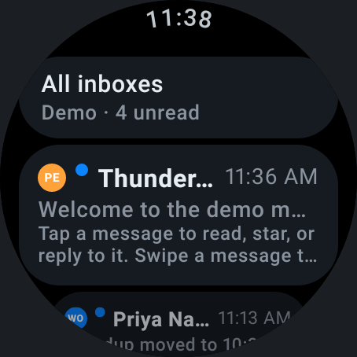
  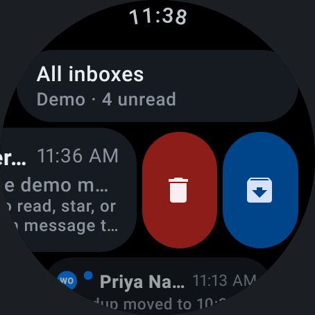
  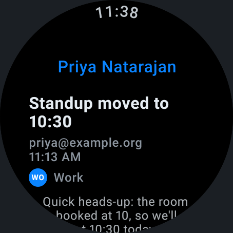
</p>
<p align="center">
  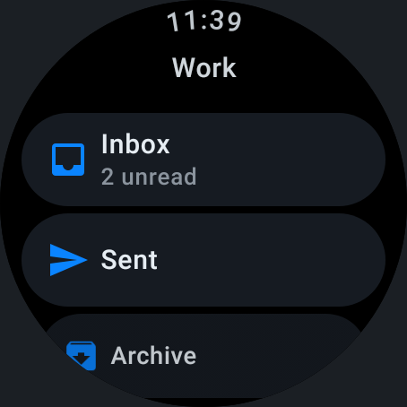
  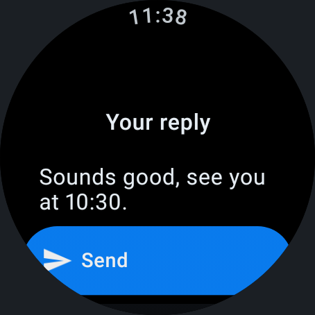
  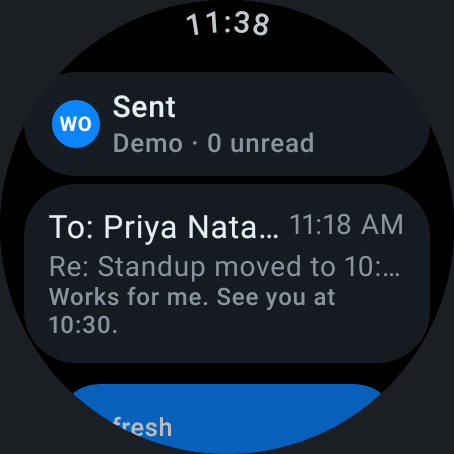
</p>
<p align="center"><em>The demo mailbox, rendered from the real watch UI.</em></p>

---

## ✅ What works today

|                     Area                     |          Status          |                                                                                                                                                       Screenshot                                                                                                                                                        |                                                                                                                                                                                                      Notes                                                                                                                                                                                                      |
|----------------------------------------------|--------------------------|-------------------------------------------------------------------------------------------------------------------------------------------------------------------------------------------------------------------------------------------------------------------------------------------------------------------------|-----------------------------------------------------------------------------------------------------------------------------------------------------------------------------------------------------------------------------------------------------------------------------------------------------------------------------------------------------------------------------------------------------------------|
| Inbox on the watch                           | ✅                        |                                                                                                                                                                                                                                | The newest 25 messages with sender, subject, preview, date, and unread/starred state.                                                                                                                                                                                                                                                                                                                           |
| All inboxes, Unread, Starred, or one account | ✅                        | 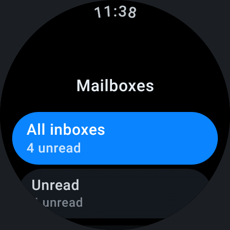                                                                                                                                                                                                                     | Tap the mailbox name at the top of the inbox to switch. "Unread" and "Starred" filter all inboxes. The watch remembers your choice.                                                                                                                                                                                                                                                                             |
| Folders                                      | ✅ New in beta7           | 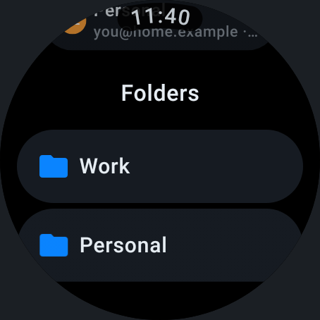   | Under **Folders** in the mailbox list, pick an account to see its folders the way the phone lists them, with unread counts. A folder works like an inbox: open, swipe, reply, and mark all as read. In Sent, messages show who they went to. Drafts and the Outbox stay on the phone. Folders are only sent to the watch when you open them.                                                                    |
| Account monograms                            | ✅                        | 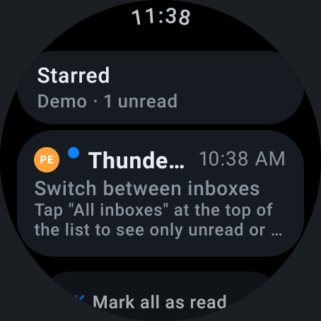                                                                                                                                                                                                       | In mixed views, each message shows its account's monogram and color, as in Thunderbird.                                                                                                                                                                                                                                                                                                                         |
| Swipe to archive or delete                   | ✅                        |                                                                                                                                                                                                                               | Swipe a message to the left: a full swipe archives it, and Delete is next to Archive. In the watch settings, choose what swiping left does (Archive or Delete) and what swiping right does (Go back, Archive or Delete). Screen readers get the same actions.                                                                                                                                                   |
| Watch settings                               | ✅                        | 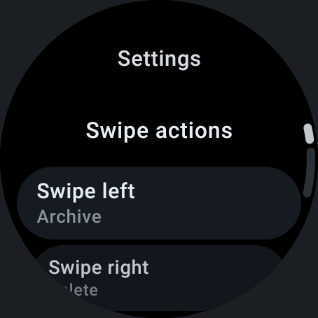                                                                                                                                                                                                                             | Swipe left and swipe right, confirm before deleting, mark as read when opened, message previews, and the demo mailbox. Open them from the end of the inbox.                                                                                                                                                                                                                                                     |
| Mark read/unread, star, archive, delete      | ✅                        | 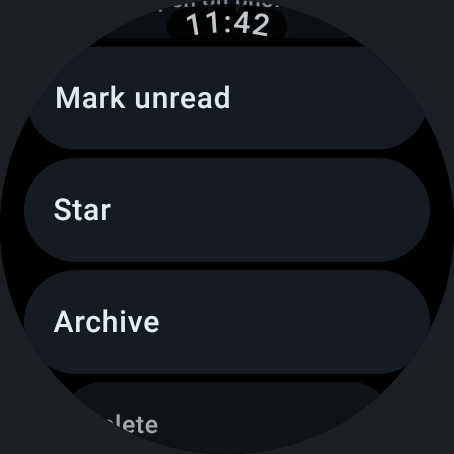                                                                                                                                                                                                                     | Sent to the phone, which applies them like the phone app does. Opening a message marks it as read, unless that's turned off in the watch settings. Messages in the Archive folder don't offer Archive.                                                                                                                                                                                                          |
| Mark all as read                             | ✅                        | 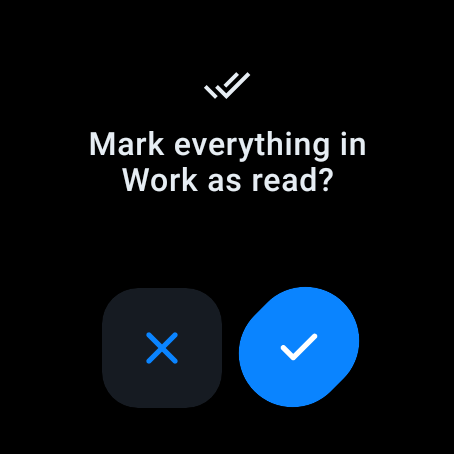                                                                                                                                                                                                         | At the end of any mailbox or folder, after a confirmation.                                                                                                                                                                                                                                                                                                                                                      |
| Reply from the watch                         | ✅                        | 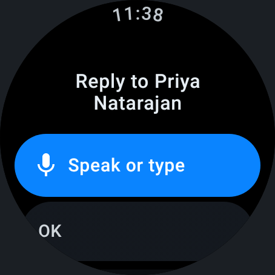                                                                                                                            | Speak, type, or pick a ready-made reply, review it, and send. Thunderbird on the phone sends it from the right account, with your signature and quoting settings, and marks the message as answered. Encrypted messages are answered on the phone.                                                                                                                                                              |
| Read the whole message                       | ✅                        |                                                                                                                                                                                                                                    | Opening a message loads its whole text from the phone. Very long messages, or ones the phone has only partly downloaded, say that the rest is on the phone.                                                                                                                                                                                                                                                     |
| Open on phone                                | ✅                        | 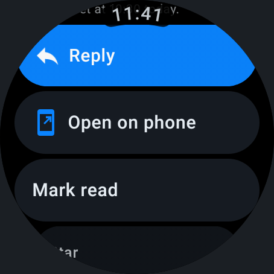                                                                                                                                                                                                            | Opens the message in Thunderbird on the phone, for reading in full.                                                                                                                                                                                                                                                                                                                                             |
| Tile                                         | ✅                        |                                                                                                                                                                                                                                                                                                                         | Shows the unread count and the newest unread messages. Tap one to open it.                                                                                                                                                                                                                                                                                                                                      |
| Complication                                 | ✅                        |                                                                                                                                                                                                                                                                                                                         | Shows the unread count on your watch face.                                                                                                                                                                                                                                                                                                                                                                      |
| Privacy                                      | ✅                        |                                                                                                                                                                                                                                                                                                                         | The Tile and complication follow Thunderbird's **Lock Screen Notifications** setting (senders and subjects, senders only, count only, or nothing). The default is count only. Folders and the whole text of messages are only sent when you open them, and aren't stored on the watch.                                                                                                                          |
| Encrypted messages                           | ✅                        | 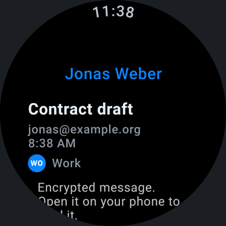                                                                                                                                                                                                                      | Shown as encrypted, with a prompt to read them on the phone.                                                                                                                                                                                                                                                                                                                                                    |
| Works briefly offline                        | ✅                        |                                                                                                                                                                                                                                                                                                                         | The watch keeps the last inboxes the phone sent. Folders need the phone, because they're loaded when you open them.                                                                                                                                                                                                                                                                                             |
| Demo mailbox                                 | ✅                        | 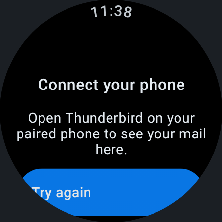                                                                                                                                                                                                 | **Try the demo** on the watch shows a sample mailbox, with folders, where everything above works, no phone needed. Real data from Thunderbird on the phone replaces it automatically. To see it with a phone connected, for example for screenshots, turn on **Demo mailbox** in the watch settings.                                                                                                            |
| Phone notifications on the watch             | ✅ Improved               |                                                                                                                                                                                                                                                                                                                         | Thunderbird's notifications offer **Reply** (voice, keyboard, or ready-made replies, sent by the phone) and **Star** on the watch, and their actions follow your notification action order.                                                                                                                                                                                                                     |
| Standalone mode (no phone)                   | ➖ Out of scope by design |                                                                                                                                                                                                                                                                                                                         | The watch would need your passwords and its own copy of the mail engine, and would sync the same mail as the phone at the cost of the watch's battery. Instead, the phone does the syncing. Away from the phone, Wear OS can reach it over Wi-Fi or mobile data as long as the phone is on and online (not tested yet). See the [RFC](docs/engineering/rfcs/0010-wear-os-companion.md#alternatives-considered). |

---

## 🧱 How it works

```
Phone: Thunderbird (full/Play build)             Watch: ThunderWren
┌──────────────────────────────────┐             ┌──────────────────────────┐
│ :feature:wear:companion:internal │─ mailboxes ▶│ Inbox, mailbox picker,   │
│  • publishes each inbox          │─ inboxes ──▶│ folders, message and     │
│  • sends folders on request      │◀─ requests ─│ reply screens, Tile,     │
│  • applies watch actions         │─ answers ──▶│ complication             │
│  • sends replies                 │             │                          │
│  • "open on phone" entry point   │             │                          │
└──────────────────────────────────┘             └──────────────────────────┘
                both use :feature:wear:companion:api (protocol)
```

* **`:feature:wear:companion:api`**: the shared protocol, covering Data Layer paths, message and mailbox models, and the JSON codec.
* **`:feature:wear:companion:internal`**: the phone side, included in Thunderbird's `full` (Play) flavor. It publishes the mailbox list and one snapshot per inbox over the Wearable Data Layer, and answers the watch's requests for folders and whole messages. It also applies actions through `MessagingController`, sends replies with `QuickReplySender` (in `legacy:core`, shared with the notification Reply action), and opens messages on request.
* **`:feature:wear:companion:noop`**: included in the `foss` (F-Droid) flavor instead, because the Data Layer needs Google Play Services.
* **`:app-thunderwren`**: the Wear OS app. It depends only on the protocol module.

---

## 🛠️ Getting Started

### Requirements

* A recent **Android Studio** release that supports Android Gradle Plugin **9.4**. If Gradle sync says the AGP version is unsupported, update Android Studio.
* Gradle JDK **17 or newer**. Android Studio's bundled JDK works.
* Android SDK Platform **37** (the project's `compileSdk`). Android Studio offers to install it on first sync.
* A **phone emulator with Google Play** (or a real phone) and a **Wear OS 3+ (API 30+) emulator**, paired with each other.

### Quickest try: the demo (watch only)

1. Create and start a *Wear OS Small Round* emulator (API 30 or newer) in Device Manager.
2. Select the **`app-thunderwren`** run configuration and run it on the watch.
3. Tap **Try the demo**. You get "All inboxes", "Unread", "Starred", and a Work and a Personal account with sample messages and folders. Open, star, reply to, swipe away, and mark them as read, switch mailboxes, browse folders, and add the Tile and complication. Nothing is sent anywhere.

**Exit demo** at the bottom of the inbox returns to the "Connect your phone" screen. If Thunderbird on a paired phone connects, its real inbox replaces the demo automatically.

### Pair a phone and a watch emulator

1. In Device Manager, create a phone emulator using a system image **with Google Play**, and a *Wear OS Small Round* emulator (API 30 or newer).
2. Start both, then use **Tools → Device Manager → ⋮ → Pair Wearable** (Android Studio's pairing assistant) to pair them. It installs the Wear OS companion app on the phone.

### Install both apps

The phone app and the watch app must have the **same application ID and signing key**, or the Data Layer won't connect them. Debug builds from the same computer satisfy both (`net.thunderbird.android.debug`, signed with your debug key).

1. Select the **`app-thunderbird`** run configuration with the **`fullDebug`** build variant (*Build → Select Build Variant*), and run it on the **phone**. Set up a mail account in it.
2. Select the **`app-thunderwren`** run configuration and run it on the **watch**.

Daily and Beta builds pair the same way: install `fullDaily` or `fullBeta` on the phone and the matching `daily` or `beta` build of `app-thunderwren` on the watch. Those need Thunderbird's signing keys, so locally only debug builds pair.

The companion and the notification quick reply are behind the feature flags `wear_companion` and `wear_notification_quick_reply`. They are on in Debug and Daily builds and off in Beta and Release for now. In debug builds, toggle them in Thunderbird's secret debug settings. While `wear_companion` is off, the phone removes its data from the watch the next time the watch asks for anything, and the watch says the companion is turned off.

Or from the command line, with both emulators running:

```bash
./gradlew :app-thunderbird:installFullDebug      # installs on the phone (pick it with ANDROID_SERIAL if needed)
./gradlew :app-thunderwren:installDebug          # installs on the watch
```

Debug builds are slow on the watch, especially right after installing. To try the watch app at full speed, install its **`optimized`** build instead of `debug` (*Build → Select Build Variant*, or `./gradlew :app-thunderwren:installOptimized`). It isn't debuggable and is shrunk like a release build, but has the debug application ID and signing key, so it still connects to the phone's `fullDebug` build.

### Tests and checks

```bash
./gradlew :feature:wear:companion:api:test :feature:wear:companion:internal:testDebugUnitTest
./gradlew :app-thunderwren:testDebugUnitTest     # view models, DI, app startup, and UI tests
./gradlew :app-thunderwren:detekt :app-thunderwren:spotlessCheck :app-thunderwren:lintDebug
```

### Try the Tile and complication

* **Tile**: swipe to the tiles carousel on the watch and add **"Unread Emails"**. To see senders and subjects on it with real mail, set **Settings → General settings → Notifications → Lock Screen Notifications** in Thunderbird on the phone to show them. The demo always shows them.
* **Complication**: long-press the watch face → *Customize* → pick a complication slot → **ThunderWren / Unread Count**.

### Troubleshooting

* **The watch says "Connect your phone"**: make sure the phone app is the **`fullDebug`** build from this repository (not `fossDebug` or the Play Store app), that the `wear_companion` feature flag is on, that it has at least one account, and that the emulators are paired. Opening Thunderbird on the phone once starts the companion.
* **CI doesn't run on your fork**: GitHub turns Actions off for forks. Enable it in the repository's **Actions** tab. The `Build - ThunderWren Wear OS application` job builds the watch app.
* **Gradle sync fails with a version catalog error**: pull the latest `main`. An earlier commit corrupted `gradle/libs.versions.toml`, which is fixed now.
* **The Gradle daemon runs out of memory**: the project reserves a 10 GB heap (`org.gradle.jvmargs` in `gradle.properties`). On machines with 16 GB of RAM or less, close other apps or lower `-Xmx`.

---

## 🗺️ Roadmap

- [x] Wear OS app with Compose for Wear OS Material 3.
- [x] Phone-first companion protocol and RFC ([0010](docs/engineering/rfcs/0010-wear-os-companion.md)).
- [x] Inboxes, mailbox switching, mail actions, open on phone, and a live Tile and complication.
- [x] Demo mailbox for trying the watch app without a phone.
- [x] Star and custom action order for Thunderbird's phone notifications on the watch.
- [x] Translatable strings, screen reader labels, and a CI build job.
- [x] Reply from the watch (voice, keyboard, or ready-made replies, sent by the phone), also from notifications.
- [x] Respect Thunderbird's notification privacy settings on the Tile and complication.
- [x] Swipe to archive or delete, Unread and Starred views, mark all as read, account monograms, and a richer Tile.
- [x] Feature flags for the phone-side parts, Daily and Beta watch builds, and screens following Thunderbird's MVI pattern.
- [x] Tested on paired phone and watch emulators in Android Studio.
- [x] Tested on a Pixel 10 Pro Fold and a Pixel Watch 5, and fixed what that turned up: watch settings, swipe choices, smoother scrolling, and clearing the watch when the companion is turned off.
- [x] Read whole messages on the watch, loaded from the phone when opened.
- [x] Folders other than the inbox, loaded from the phone when opened.
- [x] Decided against a standalone mode (no phone); the [RFC](docs/engineering/rfcs/0010-wear-os-companion.md#alternatives-considered) explains why.
- [ ] Present on [thunderbird/thunderbird-android#6969](https://github.com/thunderbird/thunderbird-android/issues/6969), the open Wear OS request.

For architectural guidelines, see [`docs/architecture/`](docs/architecture/README.md) and [`AGENTS.md`](AGENTS.md). The original upstream README is preserved in [`README.upstream.md`](README.upstream.md).

---

## 📜 License & Credits

ThunderWren is an open-source community project based on [Thunderbird for Android](https://github.com/thunderbird/thunderbird-android) and [K-9 Mail](https://k9mail.app/). It is not an official Thunderbird or MZLA product.

Licensed under the [Apache License, Version 2.0](LICENSE).
